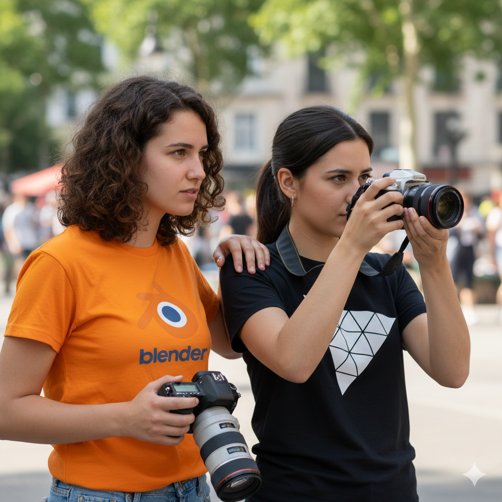

## [>>Read the documentation here<<](/module/README.md)

# Blender plugin + ThreeJs Module

1. [Blender Plugin .py](/blender-plugin/threejs-blendertools.py) ( server )
2. ThreeJs module `npm install threejs-blendertools` ( client )

### Move stuff in blender and the position, rotation and so on will be sent to your threejs scene in real time, allowing you to preview how things will look live. You will have both, blender and your threejs app opened at the same time, side by side. 

