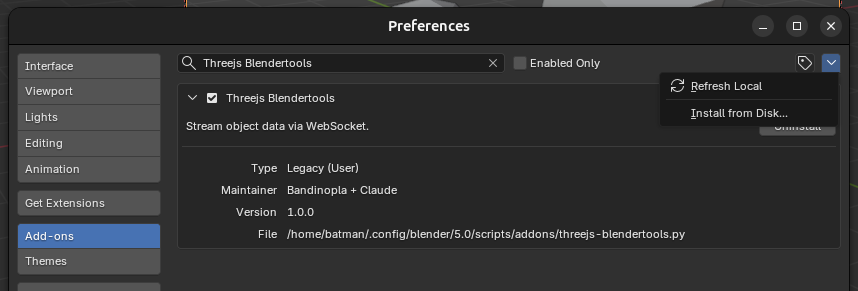
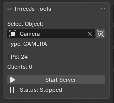

# What is this??
When working in [ThreeJs](https://threejs.org/), you will need to animate your objects and cameras and sometimes is may feel like a bit of a hassle to do so, sometimes having to create custom editors or installing libraries to control the camera, maybe a bit overkill. This is a blender plugin / Threejs library combo that simply connects / sync an object from blender to your threejs scene using WebSockets.

## In baby terms, please...
You will move stuff in blender, as you already know how to do, and the position, rotation and so on will be sent to your threejs scene in real time, allowing you to preview how things will look in threejs. You will have both, blender and your threejs app opened at the same time, side by side. 

# Blender Sync Module

This module provides utilities to synchronize Three.js scenes with Blender via a WebSocket connection. It allows for real-time updates of object positions, camera properties, and animation frames from Blender to your web application.

## Instalation in Blender

Install the python script in blender: `Edit > Preferences > Addons > Install from disk` and pick the `.py` file in `/blender-plugin` folder.

[Download the python script](/blender-plugin/threejs-blendertools.py)

 

It will look like this once installed (Side panel window)



## Installation in ThreeJs

```bash
npm install threejs-blendertools
# or
pnpm add threejs-blendertools
# or
yarn add threejs-blendertools
```

## Usage

The module exports three main functions for different synchronization needs.

### `syncWithBlender`

The generic callback. It takes a function that receives data updates from Blender.  

**Example:**
```typescript
import { syncWithBlender } from 'threejs-blendertools';

const cleanup = syncWithBlender((data) => {
  console.log('Received data from Blender:', data);
  // Update your objects here
});

// Later, when you want to stop syncing:
// cleanup();
```

### `syncCameraWithBlender`

Quick helper function specifically designed to synchronize a Three.js `PerspectiveCamera` with a camera in Blender. It updates the camera's position, rotation (quaternion), and field of view (FOV). 

**Example:**
```typescript 
import { syncCameraWithBlender } from 'threejs-blendertools';
/**
 * the camera posittion, rottion and fov will be updated everytime the blender server sends updates.
 */
const cleanup = syncCameraWithBlender(camera);
```

### `syncFrameWithBlender`

A helper function for subscribing to frame and FPS updates from Blender. This is useful for using the Blender's timeline to scrub animations on the threejs side. 

**Example:**
```typescript
import { syncFrameWithBlender } from 'threejs-blendertools';

const cleanup = syncFrameWithBlender((frame, fps) => {
  console.log(`Current Frame: ${frame}, FPS: ${fps}`);
});
``` 


## Shots Manager - Utility / Helper
Utility class to handle playing a combination of shots as one single thing. A cutscene is composed of several shots, you can play them easily using this class like this:

```typescript
import { ShotsManager } from 'threejs-blendertools';

/**
 * Normally, you will load the cameras and clips from a glb file that was animated in Blender. You will collect the cameras from the scene and the animation clips of each camera. To make things easy, each camera is expected to have the same name as the animation clip it is using. Example: camera.name = "shot1" will use animation clip.name == "shot1"
 */
const cameras = [camera1, camera2, camera3];
const clips = [clip1, clip2, clip3];
const shotsManager = new ShotsManager(cameras, clips);

/**
 * This method takes an array of strings.
 * The shot's names.
 * This allows you to experiment, like you can test a sequence like:
 * ["shot1", "shot2", "shot3"] or you may want to shuffle them...
 * ["shot2", "shot1", "shot3"] to see what order looks better... or you may only use 2 shots: ["shot1, "shot3" ]
 */ 
shotsManager.config([
	"shot1", "shot2", "shot3"
]);


/**
 * This method will start playing the sequence defined in `.config`
 */
shotsManager.play();

// and then in your animation loop....

shotsManager.update(delta);
```

When designing the shots, or when you have the shots and you want to start designing the post processing effects or so, you will want to let the sequence play in a loop as to let you touch things...

```typescript
shotsManager.loop = true; // will restart the sequence when it is done playing.
```

### SCRUB SHOTS 
So let's say you have all your shots done, and you want to start working on the sounds or postprocessing, etc.. you will use this hook and instead of playing the shots you will scrub them in blender and threejs will update respecting the timeline:

**Example:**
```typescript
import { syncFrameWithBlender, ShotsManager } from 'threejs-blendertools';

const shots = new ShotsManager( cameras as PerspectiveCamera[], animationClips );

shots.config([
	"shot1", // stairs intro
	"shot2", // hope closeup
	"shot3", // behind hope - wide shot
	"shot4" // red monk face closeup
	,"shot5" // top down descend wide shot from the side.
	,"shot-face"
	,"shot6" // ceiling shot
	,"shot7" // behind red monk / hope confrontation
]); 

// instead of calling .play we call .scrub ( blender will update this )
const cleanup = syncFrameWithBlender((frame, fps) => {
  shots.scrub( frame/fps, myMainCameraRef )
});
```

## Data Types

### `BlenderObjectData`

The data structure received from Blender:

```typescript
interface BlenderObjectData {
  position: { x: number; y: number; z: number };
  quaternion: { x: number; y: number; z: number; w: number };
  rotation: { x: number; y: number; z: number };
  fov: number | null;
  frame: number;
  fps: number;
  objectName: string;
  objectType: string;
  scrubFrame?: number;
}
```

## Connection Details

The module attempts to connect to a WebSocket server at `ws://localhost:8765`.
- It automatically handles reconnection attempts if the connection is lost or cannot be established initially (retrying every 2 seconds).
- The connection is properly closed when the returned cleanup function is called.
